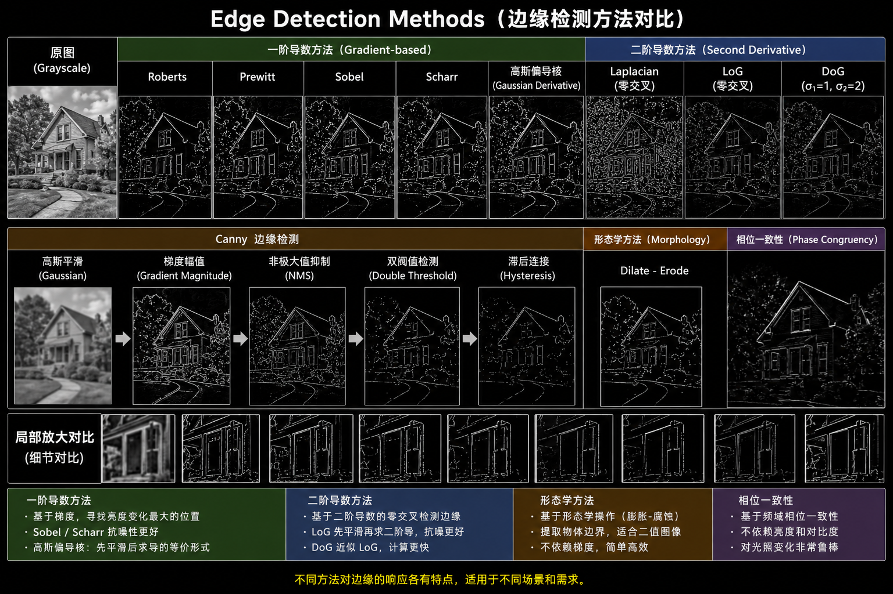

# Edge Detection

An edge is defined as a location in an image where **the signal changes abruptly**, typically corresponding to local maxima in gradient magnitude.

The main goal of edge detection is to:
- Identify locations where intensity or structural changes occur
These usually correspond to:
- Significant gradient variations
- Discontinuities in the signal

## Sources of Edges

Edges typically arise from:

- Geometric discontinuities (object boundaries)
- Surface normal changes (3D shape variation)
- Material or color changes
- Illumination changes

In computer vision, edges are commonly computed using convolution-based differentiation (gradient estimation).

<table border="1">
    <tr>
        <td>-1</td>
    </tr>
    <tr>
        <td>+1</td>
    </tr>
</table>

<table border="1">
    <tr>
        <td>-1</td>
        <td>+1</td>
    </tr>
</table>

## First-Order Derivative Methods (Gradient-based)

**Core Idea:**
> First derivative = gradient → Edge = locations with large gradient magnitude

### Prewitt

    <table border="1">
        <tr>
            <td>-1</td>
            <td>0</td>
            <td>+1</td>
        </tr>
        <tr>
            <td>-1</td>
            <td>0</td>
            <td>+1</td>
        </tr>
        <tr>
            <td>-1</td>
            <td>0</td>
            <td>+1</td>
        </tr>
    </table>
    <table border="1">
        <tr>
            <td>-1</td>
            <td>-1</td>
            <td>-1</td>
        </tr>
        <tr>
            <td>0</td>
            <td>0</td>
            <td>0</td>
        </tr>
        <tr>
            <td>+1</td>
            <td>+1</td>
            <td>+1</td>
        </tr>
    </table>

- 3×3 fixed convolution kernels
- Uses uniform weights to approximate derivatives
- Characteristics:
    - Simple and efficient
    - Sensitive to noise
    - Moderate accuracy

### Sobel

    <table border="1">
        <tr>
            <td>-1</td>
            <td>0</td>
            <td>+1</td>
        </tr>
        <tr>
            <td>-2</td>
            <td>0</td>
            <td>+2</td>
        </tr>
        <tr>
            <td>-1</td>
            <td>0</td>
            <td>+1</td>
        </tr>
    </table>
    <table border="1">
        <tr>
            <td>-1</td>
            <td>-2</td>
            <td>-1</td>
        </tr>
        <tr>
            <td>0</td>
            <td>0</td>
            <td>0</td>
        </tr>
        <tr>
            <td>+1</td>
            <td>+2</td>
            <td>+1</td>
        </tr>
    </table>

- Improvement over Prewitt by introducing center weighting
- Characteristics:
    - Higher weight on central pixels
    - Better noise robustness
    - Separable filter (efficient implementation) -> Can be interpreted as:
        - smoothing kernel + differentiation kernel $[-1, 2, -1]^T · [-1, 0, +1]$

### Scharr

<table border="1">
        <tr>
            <td>-3</td>
            <td>0</td>
            <td>+3</td>
        </tr>
        <tr>
            <td>-10</td>
            <td>0</td>
            <td>+10</td>
        </tr>
        <tr>
            <td>-3</td>
            <td>0</td>
            <td>+3</td>
        </tr>
    </table>

- Improved version of Sobel
- Characteristics:
    - Better rotational symmetry
    - More accurate directional estimation
    - Improved stability over Sobel

### Roberts

    <table border="1">
        <tr>
            <td>0</td>
            <td>+1</td>
        </tr>
        <tr>
            <td>-1</td>
            <td>0</td>
        </tr>
    </table>
    <table border="1">
        <tr>
            <td>1</td>
            <td>0</td>
        </tr>
        <tr>
            <td>0</td>
            <td>-1</td>
        </tr>
    </table>

- Computes diagonal differences (45° directions)
- Characteristics:
    - Highly sensitive
    - Very noise-sensitive
    - Suitable for fast, coarse edge detection

### Gaussian Derivative Filters

- When images contain noise:
    1. Apply Gaussian smoothing (denoising)
    2. Compute derivatives
- Since both operations are convolutions, they can be combined into:
    - Derivative of Gaussian (DoG kernel in continuous form)
- a first-order derivative filter that already incorporates smoothing
- Characteristics:
    - Combines smoothing and differentiation
    - Fundamental component of the Canny detector

## Second-Order Derivative Methods (Second derivative)

**Core Idea:**
> Edge = zero-crossings of the second derivative

### Laplacian

- Direct computation of second-order derivatives
- Isotropic (direction-independent)
- Characteristics:
    - Highly sensitive to noise
    - Amplifies high-frequency components

**Second derivative = enhanced high-frequency signals + noise = high-frequency content → Laplacian acts like an ‘amplifier of noise’.**

### Laplacian of Gaussian (LoG)

- Standard pipeline:
    1. Gaussian smoothing (denoising)
    2. Laplacian (second derivative) → detect structural changes, enhance edges
    3. zero-crossing (edge detection)
- First smooth, then detect changes
- Scale control
    - small $\sigma$  → fine detail edges
    - large $\sigma$  → only large structures are preserved
- Characteristics:
    - more stable than Laplacian
    - a classical theoretical mode

## Approximation Methods

### Difference of Gaussian (DoG)
**Core Idea:**
> **Approximates LoG using two Gaussian blurred images:**
> $DoG = G(\sigma_1) − G(\sigma_2), where \sigma_2 > \sigma_1$

- Gaussian acts as a blur operator:
    - small $\sigma$ → slight blurring
    - large $\sigma$ → strong blurring
- Subtracting a strongly blurred image from a slightly blurred image results in nearly zero difference in flat regions, while producing large differences and strong responses around edges, thereby enabling the extraction of edge information.
- Characteristics:
    - Computationally efficient
    - Multi-scale representation
    - Foundation of SIFT feature detection

## Practical Methods

### Canny

- Detection pipeline
    1. **Gaussian Smoothing**
        - Apply Gaussian filtering to the image to suppress noise and reduce errors in subsequent gradient computation.

    2. **Gradient Computation**
        - Compute the gradient magnitude and direction using derivative operators (e.g., Sobel operators or Gaussian derivative filters).

    3. **Non-Maximum Suppression (NMS)**
        - Perform local maximum detection along the gradient direction and retain only potential edge pixels, producing thin edges.

    4. **Double Thresholding**
        - According to the high and low thresholds, pixels are classified into:
            - strong edges
            - weak edges
            - non-edges (suppressed)

    5. **Hysteresis**
        - Preserve weak edges connected to strong edges and remove isolated noise points.

#### **Non-Maximum Suppression**

- Compare the two neighboring pixels along the gradient direction (quantized directions such as 0°, 45°, 90°, and 135°). If the current pixel has the maximum gradient magnitude, it is retained.

#### **Hysteresis Thresholding**

- **High threshold**: detected pixels are classified as **strong edges**, which are always retained.
- **Low threshold**: detected pixels are classified as **weak edges**, which may correspond to either edges or noise.

- The final result is determined based on connectivity:
    - Only weak edges connected to strong edges are preserved.
    - Weak edges that are not connected to strong edges are suppressed (removed).

👉 The essence is to exploit the **spatial continuity (connectivity) of edges**, preserving true edges while suppressing noise.

#### Summary
> Canny = Gaussian smoothing → Gradient → NMS → Double threshold → Hysteresis

- good detection
- good localization
- single response

## Non-Gradient Methods

### Morphology

**Core Idea:**
> **Based on morphological operations:**
>  $Edge = Dilate(I) - Erode(I)$ 

- Dilation enlarges bright regions and makes objects thicker.
- Erosion shrinks bright regions and makes objects thinner.
- Dilate − Erode ⇒ the difference between expansion and contraction highlights the boundary regions.

- Characteristics:
    - simple
    - suitable for binary / industrial images
    - does not rely on gradients

### Phase Congruency
**Core Idea:**
> Edge = locations where phases are congruent across multiple scales in the Fourier domain.

- An image can be decomposed into:
    - different frequencies
    - different phases

- Determine whether the signal structures are aligned.
    - Edge points → all frequency components (low-frequency + high-frequency) are aligned at the same location → energy is concentrated.
    - Non-edge points → frequency components are not synchronized and phases are disordered → unstable and dispersed.

- Characteristics:
    - independent of image brightness
    - highly robust to illumination changes
    - close to human perception

